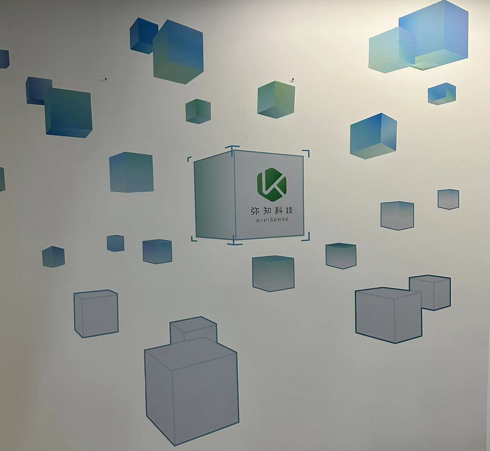
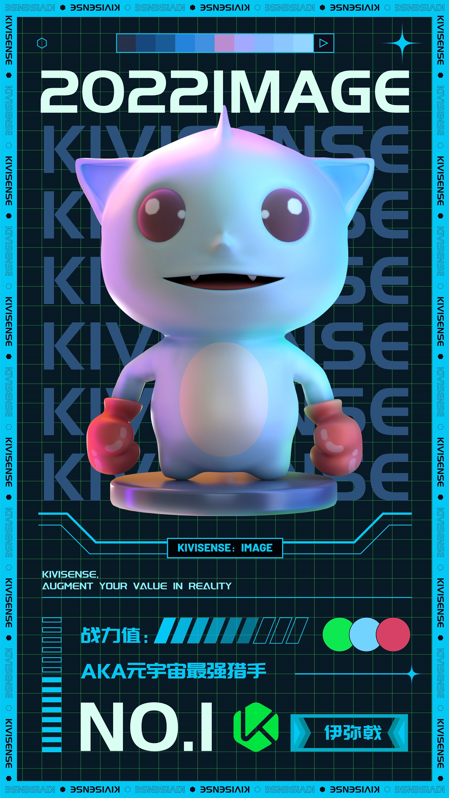
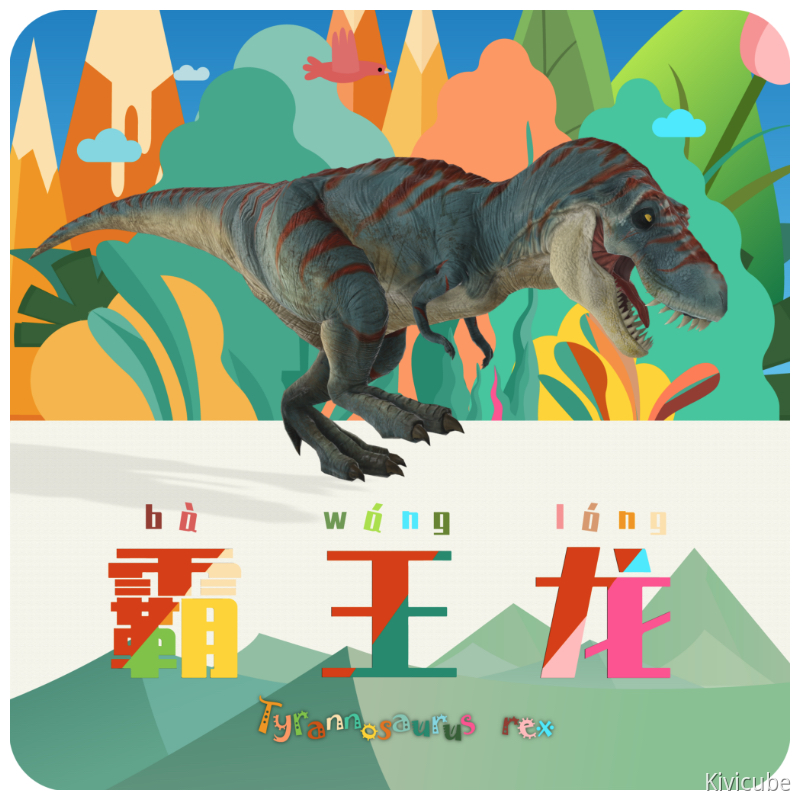
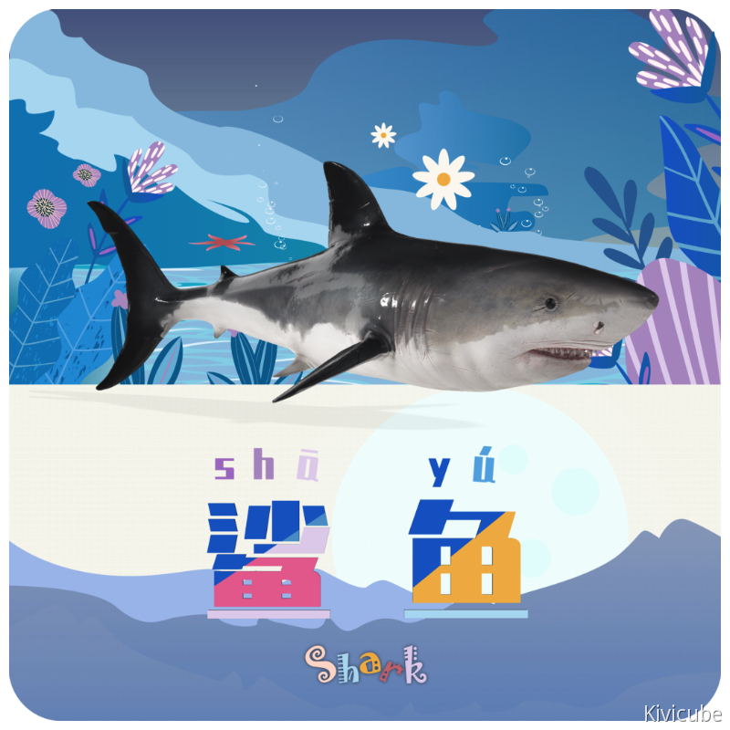

# Kivicube插件各类场景示例

如需查看如何在小程序插件中运行，请查看：[Kivicube插件入门示例](./quick-start.md)

开发文档请参考：https://www.yuque.com/kivicube/manual/mp-ar

高级API DEMO请参考：https://github.com/kivisense/wechat-kivicube-plugin-api-demo

## 源码目录

**声明：所有的示例代码仅供大家开发参考，若移植到自己的项目后有任何问题，请先自行检查和确认问题来源。确实为组件问题的，请创建Issues反馈。**

### 一、 场景

#### 1、 世界AR场景

##### (1). [世界AR场景示例](./pages/scene/world/)

识别图

效果展示：

#### 2、 平面AR场景

##### (1). [AR指示器点击放置-水平面](./pages/scene/plane/horizontal/)

##### (2). [AR指示器点击放置-竖直面](./pages/scene/plane/vertical/)

##### (3). [检测到平面自动放置](./pages/scene/plane/auto-place/)

#### 3、 漫游AR场景

##### (1). [漫游AR场景示例](./pages/scene/roam/)

#### 4、 图像AR场景

##### (1). [图像AR场景示例](./pages/scene/image-ar/)

#### 5、 云识别/陀螺仪场景

##### (1). [云识别/陀螺仪场景示例](./pages/scene/cloudar/)

#### 6、 3D互动场景

##### (1). [3D互动](./pages/scene/index/)

### 二、 合辑

#### 1、 世界AR合辑

*敬请期待*

#### 2、 平面AR/漫游AR合辑

*敬请期待*

#### 3、 图像AR合辑

##### (1). [图像AR合辑示例](./pages/collection/image-ar/)

识别图1：

识别图2：

#### 4、 云识别/陀螺仪合辑

##### (1). [云识别/陀螺仪合辑示例](./pages/collection/cloudar/)

识别图1：

识别图2：

