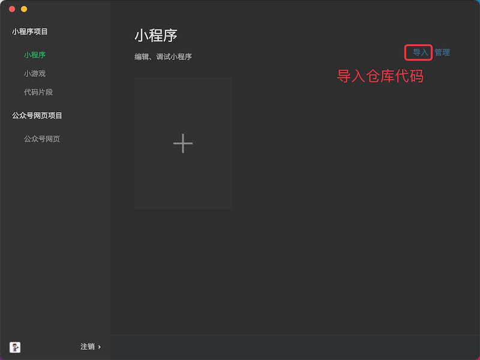
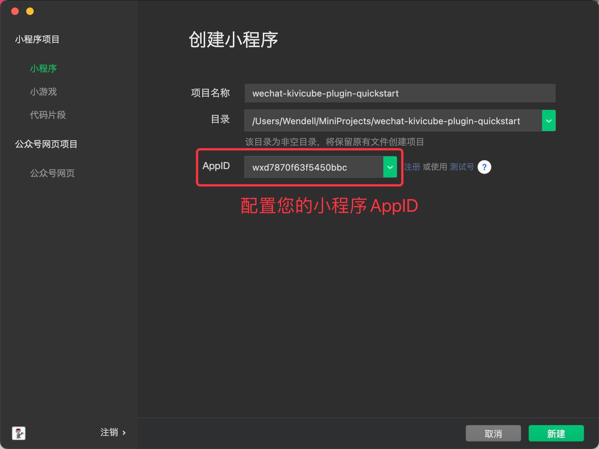
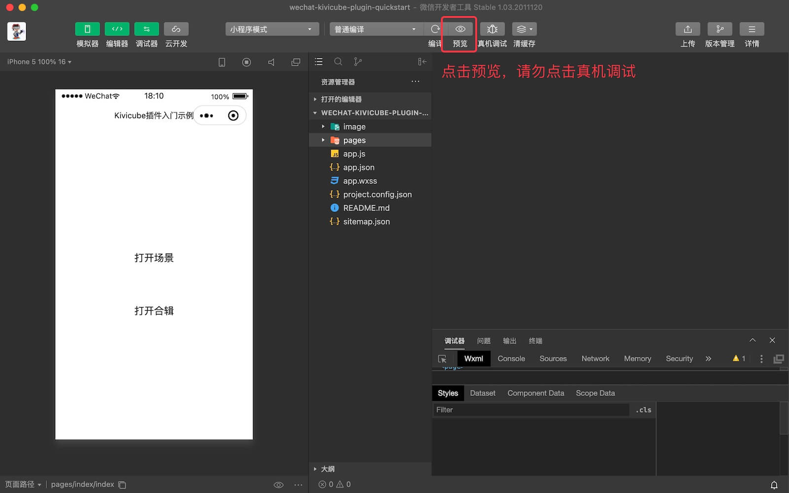
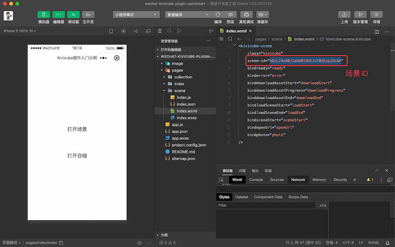
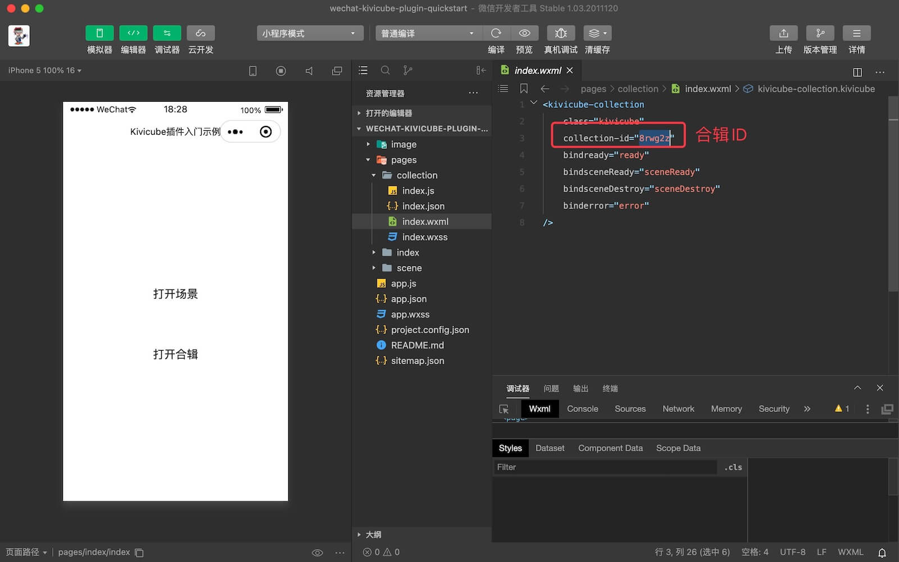

# Kivicube插件入门示例

## 1.导入微信开发者工具
  

  

## 2.预览小程序AR效果

### 2.1在微信开发者工具中生成预览二维码

  

  

### 2.2打开AR场景体验

点击首页“打开场景”，跳转到AR场景页面进行AR体验。您也可以更改场景ID，预览属于您自己的AR场景。  

  

### 2.3打开AR合辑体验
点击首页“打开合辑”，跳转到AR合辑页面，您可以扫描如下两张识别图进行体验。

  

  

您也可以更改合辑ID，预览属于您自己的AR合辑。  
  
## 3.了解更多关于小程序AR教程
https://www.kivicube.com/blog/mp-ar-plugin/  